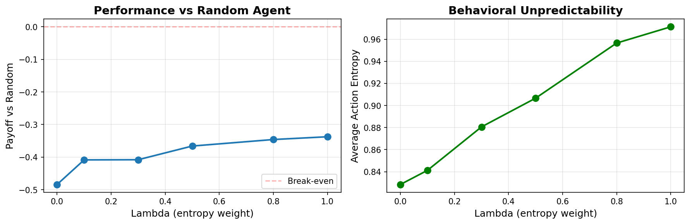
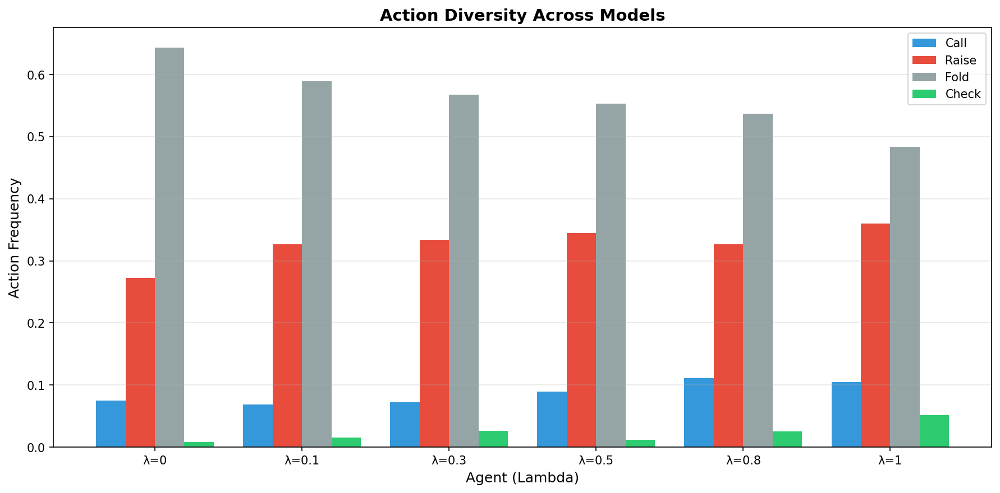
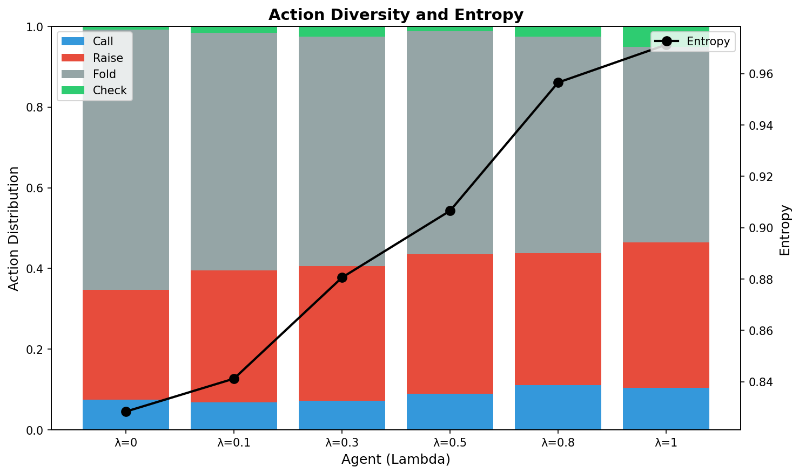
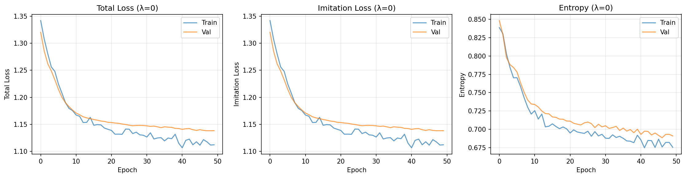
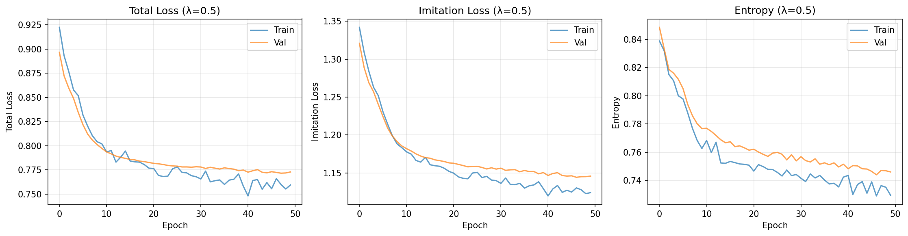
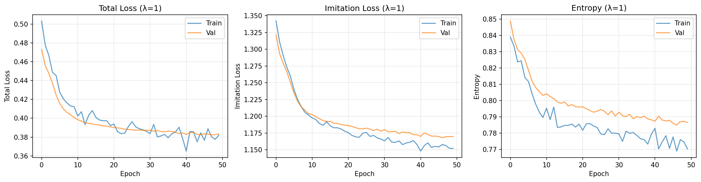
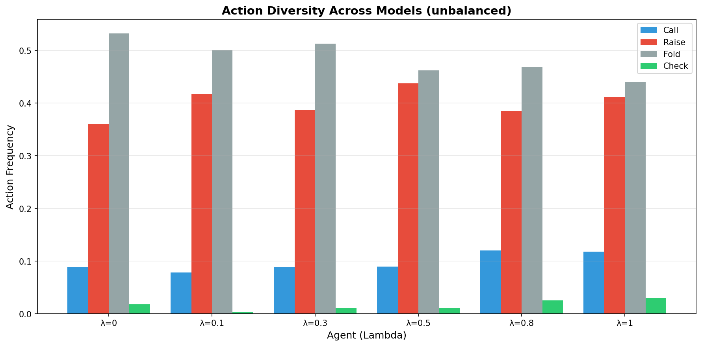
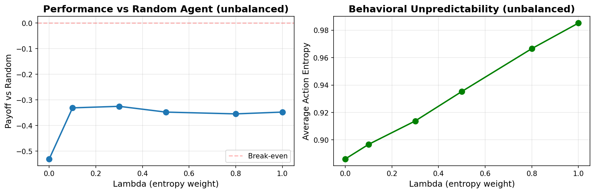

# Deceptive Poker AI: Entropy-Regularized Neural Agents

**Can AI learn to bluff? Exploring strategic deception in Limit Texas Hold'em through entropy regularization.**

*A machine learning project examining whether introducing controlled unpredictability into poker agents can produce more human-like, deceptive behavior.*

---

## Project Overview

This project investigates a non-standard approach to building poker-playing AI agents by combining traditional game-theoretic foundations with entropy regularization to encourage strategic deception and unpredictability. Rather than purely optimizing for Nash equilibrium strategies as seen in Counterfactual Regret Minimization (CFR), this work explores whether adding an entropy term can make agents more human-like in their bluffing behavior. Traditional poker AI converges to mathematically optimal but highly predictable strategies, while human players exhibit strategic unpredictability that makes them harder to exploit. The central question is whether we can bridge this gap by explicitly encouraging diversity in action selection without completely sacrificing performance.

The motivation stems from observations about expert human poker play, where deception through bluffing is not just random noise but a carefully calibrated strategic tool. Players vary their actions in similar situations to prevent opponents from reading their hands, bluff with weak holdings to win pots they would otherwise lose, and occasionally make suboptimal plays to maintain unpredictability. This project tests whether neural networks can learn similar behavior patterns when trained with an entropy bonus that rewards diverse action distributions, particularly in situations where the agent appears to hold weak hands.

---

## Approach

The core innovation is a modified loss function for supervised learning from CFR policies that explicitly trades off imitation accuracy for behavioral diversity:

```
Loss = Imitation_Loss - λ * Entropy
```

- **imitation loss**: standard cross-entropy for mimicking the CFR teacher's action probabilities
- **entropy term**: measures unpredictability in the model's action selection
- **λ (lambda)**: hyperparameter that controls the tradeoff between faithful reproduction of the optimal strategy and introduction of controlled randomness. When λ is zero, the model performs pure imitation learning and converges to the deterministic CFR policy. As λ increases, the model is incentivized to maintain higher entropy in its action distributions, leading to more mixed strategies even when the teacher's policy is relatively deterministic.

The entropy term is bluff-aware, meaning it selectively encourages randomness when the agent appears to have weak hands based on the target action probabilities. This is implemented by estimating hand strength from the CFR policy's action distribution, with aggressive actions like raising suggesting strong hands and passive actions like checking or folding suggesting weak ones. The entropy regularization is then weighted inversely to this estimated strength, encouraging the model to stay decisive with strong hands while mixing strategies with weak hands. This mimics the human tendency to bluff more frequently with marginal holdings, where unpredictability has the highest strategic value.

---

## Theoretical Foundation

### Why Entropy Regularization?

Traditional poker AI systems like those based on Counterfactual Regret Minimization converge to Nash equilibrium strategies that are mathematically optimal against perfect opponents. However, these strategies have several limitations in practice:

- **Over-deterministic**: Become increasingly predictable as training progresses, allowing observant opponents to exploit patterns
- **Optimized for perfect play**: Designed for adversarial opponents rather than exploiting weak players
- **Lack strategic diversity**: Don't exhibit the deliberate unpredictability that characterizes expert human play

Entropy regularization addresses these issues by explicitly maintaining stochasticity in action selection throughout learning. The approach draws inspiration from maximum entropy reinforcement learning, where the agent maximizes expected reward while also maximizing policy entropy. In poker, this means performing well while remaining unpredictable across similar game states. The key insight is that predictability itself is a vulnerability in imperfect information games, as it allows opponents to narrow down the agent's possible hand ranges and make better-informed decisions.

The theoretical justification rests on a practical observation: Nash equilibrium strategies, while unexploitable by perfect opponents, may not be optimal against realistic opponent distributions. Many opponents are exploitable through patterns in their play, and a perfectly balanced strategy may miss opportunities to capitalize on these weaknesses. By introducing controlled randomness through entropy regularization, the agent maintains flexibility while protecting itself from being exploited through predictable patterns.

### Bluff-Aware Entropy Weighting

Not all game situations benefit equally from randomness. In poker, the strategic value of unpredictability varies dramatically based on hand strength and board texture. With premium hands, players generally want to play straightforwardly to build the pot and extract maximum value. With marginal hands, however, unpredictability becomes crucial for maintaining a credible threat of holding stronger holdings. The bluff-aware weighting mechanism captures this intuition by modulating the entropy bonus based on estimated hand strength derived from the CFR teacher's action distribution.

The implementation estimates hand strength through a weighted combination of the target action probabilities, where aggressive actions receive higher weights and passive actions receive lower weights. Specifically, raising is assigned the highest weight as it most strongly signals hand strength, calling receives a moderate weight, and folding receives zero weight. The resulting aggressive score serves as a proxy for hand strength, with high values indicating likely strong holdings and low values indicating weak holdings. The entropy weighting is then computed as one minus this aggressive score, ensuring that states with weak apparent holdings receive stronger encouragement to diversify their strategies.

```python
# Aggressive actions (raise > call > check/fold) suggest strong hands
ACTION_WEIGHTS = [0.5, 1.0, 0.0, 0.5]  # [call, raise, fold, check]
aggressive_score = sum(target_probs * ACTION_WEIGHTS)

# Weak hands get higher entropy weight → more bluffing
bluff_weight = 1.0 - aggressive_score

# Apply weighted entropy regularization
weighted_entropy = bluff_weight * entropy
```

This formulation encourages the model to stay decisive with strong hands, where maximizing immediate expected value is paramount, while mixing strategies with weak hands, where the ability to represent a range of holdings provides strategic value. The result is a learned policy that exhibits human-like patterns of selective aggression and strategic deception, bluffing more frequently in situations where the CFR baseline recommends folding or calling passively. By grounding the entropy bonus in estimates of hand strength, the approach avoids the pitfall of uniform randomization that would make all actions equally unpredictable regardless of strategic context.

---

## Methodology

### 1. CFR Training & Data Collection

The data collection process began with training a CFR agent on two-player Limit Texas Hold'em for 500 iterations through self-play. This training took approximately nine hours on available computational resources, representing a significant constraint on the project. After training, the agent played 5,000 self-play games to collect state-action pairs, yielding approximately 10,000 raw examples.

The raw dataset exhibited severe imbalances that threatened training quality:
- **89% uniform strategies**: Most states showed equal probability over all legal actions, indicating limited strategic learning
- **97% fold actions**: Reflected both CFR's conservative early-stage policies and natural weak hand frequency
- **Minimal diversity**: Would cause models to learn degenerate fold-heavy strategies

To address this, the dataset was balanced through stratified sampling. States were classified as uniform (action probability std < 0.01) or non-uniform, then equal numbers were sampled from each category. This reduced the dataset to 5,702 balanced examples with much healthier action distributions (29% folds, 27% raises). However, 500 CFR iterations represents only ~5% of the recommended training duration for strong Limit Hold'em play, imposing an upper bound on achievable performance. However, an interesting observation is that the balanced dataset actually led to worse performance than the unbalanced version, likely because the unbalanced dataset's fold bias better matched the weak CFR baseline's inherent conservatism.

### 2. Neural Network Training

The neural network is a multi-layer perceptron (MLP) with 72-dimensional input, two hidden layers of size [32, 16] with ReLU activation and dropout, and a 4-unit softmax output layer. 

Six separate models were trained with lambda values [0, 0.1, 0.3, 0.5, 0.8, 1.0] to explore the entropy-performance tradeoff spectrum. The loss function combined standard cross-entropy imitation loss with the weighted entropy bonus. 

### 3. Evaluation Metrics

All models were evaluated through 1,000 games against a random baseline, measuring:
- **Performance**: Average chip profit/loss per game (captures magnitude of wins/losses, not just win rate)
- **Entropy**: Shannon entropy of action probability distributions at each decision point
- **Action diversity**: Empirical frequency of actions actually taken during evaluation

The evaluation also generated detailed visualizations comparing models across the lambda spectrum, including performance curves, action diversity bar charts, and combined plots overlaying distributions with entropy trends.

---

## 🛠️ Technical Implementation

### Project Structure

```
deceptive-poker-ai/
├── get_cfr_data.py          # CFR training + data collection
├── train.py                 # Neural network training with entropy regularization
├── evaluate.py              # Performance and behavioral evaluation
├── data/
│   ├── cfr_dataset_5000eps_balanced.pkl
│   └── cfr_model_500itr/
├── models/                  # Trained model checkpoints
└── results/                 # Evaluation plots and metrics
```

### Key Components

**Data Collection (`get_cfr_data.py`):** Implements the full CFR training pipeline, loading existing models or training new ones for 500 iterations. After training, it generates state-action pairs through self-play, balances the dataset 50-50 uniform/non-uniform through stratified sampling, and serializes to disk for neural network training.

**Training (`train.py`):** Loads the balanced dataset and implements the custom loss function combining imitation learning with entropy regularization. Automatically detects dataset type from filename and adjusts output naming. Trains six separate models with different lambda values from random initialization, monitoring validation loss for early stopping and generating training curves for diagnosis.

**Evaluation (`evaluate.py`):** Wraps trained PyTorch models as RLCard agents, implementing the action selection interface. Collects detailed statistics during 1,000 evaluation games including chip deltas, action probability distributions for entropy computation, and actual sampled actions for diversity measurement. Generates comparison plots across the lambda spectrum.

### Running the Code

**Requirements:**
```bash
pip install -r requirements.txt
```

**Pipeline:**
```bash
# 1. Generate training data (skippable)
python get_cfr_data.py

# 2. Train models 
python train.py

# 3. Evaluate 
python evaluate.py
```

---

## Key Results

### Performance vs Random Baseline


*Figure 1: Left panel shows average chip profit/loss per game against random opponent across different entropy weights. All models exhibit negative expected value, but higher entropy weights reduce losses. Right panel shows that behavioral unpredictability increases linearly with lambda, confirming successful entropy regularization.*

The performance evaluation revealed that all models, regardless of entropy weight, lost chips on average when playing against the random baseline. The pure imitation learning model (λ=0) achieved an average payoff of -0.48 chips per game, representing the baseline performance when simply mimicking the weak CFR teacher. As entropy weight increased, performance consistently improved, with λ=1 achieving -0.34 chips per game. This represents a 29% reduction in losses compared to pure imitation, demonstrating that entropy regularization did not degrade performance despite introducing randomness. The improvement was monotonic across lambda values, with the largest gains occurring in the range from λ=0 to λ=0.3, after which returns diminished but remained positive.

The behavioral unpredictability metric confirmed that entropy regularization achieved its intended effect on action distributions. The λ=0 model exhibited an average entropy of 0.833 during evaluation, reflecting the mixture of deterministic fold decisions and occasional mixed strategies inherited from the CFR baseline. As lambda increased, entropy rose steadily to 0.906 at λ=0.5 and 0.971 at λ=1, approaching the theoretical maximum for a four-action problem. This demonstrates that the models successfully learned to maintain diverse action distributions even after training, rather than collapsing to deterministic policies that would minimize the loss function by setting the entropy term to zero through precise probability assignments.

### Action Diversity Analysis


*Figure 2: Frequency of each action type during evaluation games. Higher entropy weights lead to less folding and more aggressive play, with the λ=1 model exhibiting the most balanced action distribution.*

The action diversity analysis revealed dramatic shifts in behavioral patterns across the entropy spectrum. The λ=0 model folded in 65% of decision points during evaluation, reflecting the conservative bias of the CFR baseline compounded by the model's tendency to collapse toward the most confident predictions. This fold-heavy strategy is highly exploitable in poker, as it allows opponents to win pots simply by betting whenever the agent shows weakness. As entropy weight increased, folding frequency decreased substantially, dropping to 55% at λ=0.5 and 48% at λ=1. This reduction in passive play was redistributed across the aggressive actions, with raising increasing from 27% to 36% and calling from 7% to 11%. Checking frequency also increased modestly from 1% to 5%, though it remained the least common action due to situational availability.

The shift toward more aggressive play explains much of the performance improvement observed in higher entropy models. In poker, excessive folding is economically disastrous because it forfeits equity in every pot, even when holding hands with positive expected value. A player who folds 65% of the time is effectively conceding most hands to the opponent without contest, allowing even a random player to profit by simply betting frequently. By diversifying their action selections, higher entropy models contested more pots and prevented the random opponent from winning by default. This demonstrates that the entropy regularization achieved not just statistical diversity in action distributions, but strategically meaningful diversity that translated into better economic outcomes.


*Figure 3: Stacked bar chart showing action distributions (bottom) overlaid with entropy progression (line). The visualization confirms that increased entropy manifests as reduced folding and broader action repertoires.*

The combined visualization highlights the relationship between entropy and action diversity. The stacked bars show how the action distribution evolves across lambda values, with the fold component steadily shrinking while the call and raise components expand. The entropy line overlaid on this chart rises monotonically, confirming the tight coupling between statistical entropy and practical action diversity. The visualization also reveals that check actions, while increasing in frequency, remained a minor component of the action distribution even at high entropy. This reflects the limited strategic scenarios where checking is legal and beneficial in Limit Hold'em, where bets are often mandatory or clearly advantageous.

### Training Dynamics


*Figure 4: Training curves for pure imitation learning (λ=0) showing convergence of total loss, imitation loss, and entropy over 50 epochs.*


*Figure 5: Training curves for moderate entropy regularization (λ=0.5) showing lower total loss due to entropy bonus while maintaining similar imitation loss.*


*Figure 6: Training curves for maximum entropy (λ=1) showing successful tradeoff between imitation accuracy and diversity.*

The training curves reveal healthy convergence dynamics across all models without evidence of overfitting. The λ=0 model converged to a validation loss of approximately 1.14, representing the baseline difficulty of imitating the CFR teacher's action distributions. The training and validation curves tracked closely throughout training, suggesting the model was not memorizing training examples but rather learning generalizable patterns. The entropy component of the loss remained relatively stable around 0.69, reflecting the natural entropy present in the CFR teacher's mixed strategies even without explicit regularization.

As entropy weight increased, the total loss decreased substantially due to the growing contribution of the entropy bonus term. The λ=1 model achieved a total loss of approximately 0.39, dramatically lower than the λ=0 baseline, but this should not be interpreted as better performance in an absolute sense. Rather, it reflects successful optimization of a different objective function that values diversity alongside accuracy. The imitation loss component remained similar across models, indicating that the entropy regularization did not prevent the models from learning the structure of the CFR policy, but rather encouraged them to express that learned structure through more diverse action distributions. The entropy term itself showed the expected pattern, starting high due to random initialization and decreasing as the model learned, but stabilizing at progressively higher levels for models with stronger entropy regularization.

---

## Detailed Analysis

### Balanced vs Unbalanced Dataset Comparison


*Figure 7: Action distributions from models trained on the unbalanced dataset show similar trends but with slightly different magnitudes.*


*Figure 8: Performance curves from unbalanced dataset show marginally better absolute performance but similar relative improvements from entropy regularization.*

The comparison between balanced and unbalanced datasets yielded a counterintuitive finding: the balanced dataset actually produced slightly worse performance. At λ=1, balanced models achieved -0.34 chips per game versus -0.35 for unbalanced, with this pattern holding across all entropy weights. The explanation lies in alignment between dataset biases and teacher weaknesses. The unbalanced dataset's natural fold bias, while suboptimal, more accurately reflected the weak CFR baseline's true behavior. Balancing injected noise that moved models away from faithful imitation, and since the teacher was weak, this deviation produced occasional fortunate randomness rather than systematic improvement.

Behavioral metrics showed balanced models achieved slightly higher entropy (0.971 vs 0.968 at λ=1) but lower aggression, with raise frequencies of 36% versus 41% at λ=0.5. This reduced aggression likely explains the performance gap—folding less often prevented unnecessary pot concessions. The lesson: dataset balancing isn't always beneficial, particularly when the teacher is imperfect and balancing introduces artificial patterns deviating from the teacher's true behavior.

### Why Models Still Lose to Random

Despite consistent improvements from entropy regularization, all models exhibited negative expected value against random play. The root causes:

**Weak CFR baseline**: 500 iterations represents ~5% of the recommended 10,000+ needed for Limit Hold'em. The CFR agent had barely explored the game tree, exhibiting near-uniform distributions in most states—effectively random play that supervised models faithfully reproduced.

**Fold-heavy bias**: Even with maximum entropy, models folded 48-53% of the time, conceding half of all pots without contest. In poker, folding forfeits pot equity, and against opponents betting frequently without regard for hand strength, excessive folding enables easy profit. Entropy regularization reduced folding significantly but couldn't overcome the conservative prior from CFR training.

**Limit Hold'em dynamics**: Fixed bet sizes reduce penalties for poor decisions compared to No-Limit. Random players lose slowly because bad bets are capped, giving more opportunities for lucky draws. The simplified action space also makes random play less exploitable than in No-Limit with arbitrary bet sizing.


---

## Limitations

### Computational Constraints

The most significant limitation was insufficient CFR training: 500 iterations in nine hours represents ~5% of the recommended 10,000-20,000 iterations. This produced a weak baseline exhibiting near-random behavior in most game states. A stronger baseline would likely show different entropy-performance relationships, possibly non-monotonic as excessive entropy moves agents away from equilibrium.

Computational constraints also prevented:
- **Self-play reinforcement learning**: Agents discovering strategies through self-competition
- **Online learning**: Adaptation to opponent styles during live play  
- **Opponent modeling**: Dynamic exploitation of specific tendencies

### Methodological Limitations

Supervised learning imposed fundamental constraints—models could only reproduce training data patterns, never discovering novel strategies or adapting to unseen opponents. A better approach would combine supervised pre-training with self-play fine-tuning.

Evaluation limitations:
- **Single opponent type**: Only tested against random, not diverse strategies
- **Limited metrics**: Entropy and diversity don't directly measure strategic sophistication  
- **No exploitability testing**: Unclear if agents are harder to exploit than baseline

Dataset balancing, intended to improve training, hurt performance by over-representing rare decisive states and creating distribution shift from the teacher's true behavior.


---

## Ethical Considerations

### Risks of Deceptive AI in Games

The development of AI systems capable of strategic deception, even in benign contexts like poker, raises important ethical questions. The most immediate concern is the potential for poker bots to infiltrate online platforms and exploit human players for profit. Modern online poker represents a multi-billion dollar industry where many players rely on the game as income, and undetectable AI agents could systematically extract value from these ecosystems. The techniques developed in research contexts, including entropy regularization to create more human-like behavioral patterns, could make such bots harder to detect.

Beyond direct economic harm, there are psychological and social concerns:
- **Loss of trust**: If players cannot distinguish human opponents from AI, it degrades the social experience
- **Gambling addiction**: Highly engaging AI opponents might exacerbate problematic behaviors in vulnerable populations
- **Transparency questions**: Should platforms disclose AI opponents, even if disclosure reduces effectiveness?

### Responsible Development Principles

This project was conducted with several principles to minimize harmful deployment potential:
- **Academic context**: Research goal was understanding deception mechanisms, not building exploitative tools
- **Full disclosure**: All code and methodology openly shared to enable detection methods
- **No deployment**: Models remain proof-of-concept demonstrations, not production systems

I believe research into deceptive AI can be conducted responsibly when it prioritizes transparency over performance, maintains clear boundaries between research and deployment, considers dual-use implications during design, and engages with affected communities to understand their concerns.

### The Broader Question

Should we build AI systems that intentionally deceive, even in circumscribed domains like games? Arguments in favor emphasize that games provide safe testbeds for studying deception, understanding these capabilities helps defend against malicious applications, and there is scientific value in studying complex cognitive capabilities like strategic reasoning. Arguments against warn that normalizing deceptive AI design creates infrastructure for harmful applications, techniques can transfer to problematic domains like fraud or manipulation, and resources might be better spent on transparency and alignment.

My perspective is that studying deception in constrained and transparent research contexts provides valuable scientific insights that outweigh the risks when conducted responsibly. The key is maintaining clear boundaries, emphasizing transparency, and being thoughtful about which techniques to develop and share. This project stays firmly in the research category—the agents are not competitive, the code is open for examination, and the documentation honestly discusses both capabilities and limitations. However, I recognize that research contributions can be combined into more capable systems, and there is legitimate debate about whether certain lines of inquiry should be pursued at all.


---

*"In poker, as in life, the question isn't whether to be predictable or random, but rather: when should you be each, and can you make that choice strategically? This project suggests AI can learn the 'what' of deception, but the 'when' and 'why' remain uniquely human... for now."*

---

## References

Zha et al. (2019). "RLCard: A Toolkit for Reinforcement Learning in Card Games" [(Paper)](https://arxiv.org/abs/1910.04376) [(GitHub)](https://github.com/datamllab/rlcard)